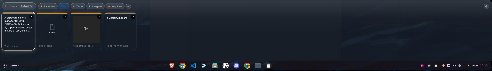

# Visual Clipboard

🇧🇷 Português | [🇺🇸 English](README.md)

Gerenciador de clipboard para Linux (X11/GNOME) inspirado no Clp do macOS.
Histórico local de **texto, links, código, imagens e arquivos** (inclusive vídeo), com busca instantânea, boards, edição inline e colagem automática.

Código aberto (MIT) — faça fork, modifique, use como quiser.



## Requisitos

- Linux com X11 (testado em Zorin OS / GNOME)
- Node.js >= 18
- `xdotool` para colagem automática: `sudo apt install xdotool` (sem ele, o clip só é copiado — cole com Ctrl+V)

## Instalação

Um comando só (baixa e instala tudo, sem clonar manualmente):

```bash
curl -fsSL https://raw.githubusercontent.com/tharlei/visual-clipboard-linux/main/install.sh | bash
```

Ou clone e rode você mesmo:

```bash
git clone https://github.com/tharlei/visual-clipboard-linux.git
cd visual-clipboard-linux
./install.sh
```

Instala nos lugares padrão por usuário do Linux — `~/.local/share/visual-clipboard/app` (código), `~/.local/bin/visual-clipboard` (launcher), `~/.local/share/applications` (entrada no menu de apps) — e baixa o Electron via `npm install` (~150MB, só na primeira vez). Depois é só rodar `visual-clipboard` ou abrir "Visual Clipboard" no menu de aplicativos.

Para remover: `visual-clipboard --uninstall` (o histórico em `~/.local/share/visual-clipboard/*.json` é preservado — apague essa pasta também para limpar tudo).

### Desenvolvimento / rodar direto da fonte

```bash
npm install
npm start
```

- **Ctrl+Alt+V** abre/fecha o painel (ou clique no ícone da bandeja).
- Copie qualquer coisa normalmente — vira card no histórico.
- **Busca** digitando; **tabs** filtram por tipo; **1–9** seleciona; **←/→ + Enter** navega; **Esc** fecha.
- **E** edita o card focado (texto/link/código) ou abre o arquivo; **Delete** apaga o card focado; **Ctrl+Enter** salva no editor.
- Clicar num card copia e **cola automaticamente** no app que estava focado.
- **Arraste um card para fora**: imagem/vídeo/arquivo solta o **arquivo real** (o caminho, se soltar num terminal); texto solta em uma única linha.
- **Configurações** (⚙ no canto, ou bandeja → Configurações): muda atalho, colagem automática, atraso e tamanho do histórico — sem editar arquivo.
- Passe o mouse no card: fixar 📌, editar ✎ (texto/link/código), abrir arquivo, boards, apagar.
- **Boards** (botão `+`): coleções fixas — não expiram nem entram no "Limpar histórico".
- Bandeja: abrir, limpar histórico, **iniciar com o sistema**, sair.

## Dados e configuração

Tudo 100% local em `~/.local/share/visual-clipboard/`:

- `history.json` — histórico e boards
- `images/` — imagens capturadas
- `config.json` — ajustes:

```json
{ "shortcut": "Control+Alt+V", "maxItems": 500, "autoPaste": true, "pasteDelayMs": 150 }
```

Edite o arquivo e reinicie, ou use o painel ⚙ **Configurações** no app (aplica na hora). O instalador também pergunta algumas dessas opções na primeira vez.

## Segurança e privacidade

Roda inteiramente na sua máquina. Não tem servidor, telemetria, conta ou chamadas de rede — nada é monitorado ou enviado a lugar nenhum. Seu histórico nunca sai de `~/.local/share/visual-clipboard/`.
