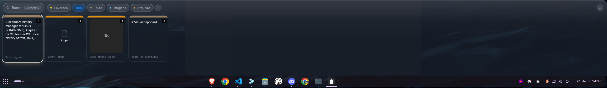

# Visual Clipboard

🇧🇷 Português | [🇺🇸 English](README.md)

Gerenciador de clipboard para Linux (X11/GNOME) inspirado no Clp do macOS.
Histórico local de **texto, links, código, imagens e arquivos** (inclusive vídeo), com busca instantânea, boards, edição inline e colagem automática.

Código aberto (MIT) — faça fork, modifique, use como quiser.



## Requisitos

- Linux com X11 (testado em Zorin OS / GNOME)
- Node.js >= 22.12 (exigido pelo Electron 43)
- `xdotool` para colagem automática: `sudo apt install xdotool` (sem ele, o clip só é copiado — cole com Ctrl+V)

## Instalação

Um comando só (baixa e instala tudo, sem clonar manualmente):

```bash
curl -fsSL https://raw.githubusercontent.com/tharlei/visual-clipboard-linux/main/install.sh | bash
```

Ou clone e rode você mesmo:

```bash
git clone https://github.com/tharlei/visual-clipboard-linux.git
cd visual-clipboard-linux
./install.sh
```

Instala nos lugares padrão por usuário do Linux — `~/.local/share/visual-clipboard/app` (código), `~/.local/bin/visual-clipboard` (launcher), `~/.local/share/applications` (entrada no menu de apps) — e baixa o Electron (~150MB, só na primeira vez). O app abre assim que a instalação termina — depois disso, é só rodar `visual-clipboard` ou abrir "Visual Clipboard" no menu de aplicativos.

Para remover: `visual-clipboard --uninstall`. Ele pergunta se você quer manter o histórico de clips ou apagar tudo; use `--purge` para pular a pergunta e limpar tudo de uma vez.

### Desenvolvimento / rodar direto da fonte

```bash
npm install
npm start
```

- **Ctrl+Alt+V** abre/fecha o painel (ou clique no ícone da bandeja).
- Copie qualquer coisa normalmente — vira card no histórico.
- **Busca** digitando; **tabs** filtram por tipo; **1–9** seleciona; **←/→ + Enter** navega; **Esc** fecha.
- **E** edita o card focado (texto/link/código) ou abre o arquivo; **Delete** apaga o card focado; **Ctrl+Enter** salva no editor.
- Clicar num card copia e **cola automaticamente** no app que estava focado.
- **Arraste um card para fora**: imagem/vídeo/arquivo solta o **arquivo real** (o caminho, se soltar num terminal); texto solta em uma única linha.
- **Configurações** (⚙ no canto, ou bandeja → Configurações): muda atalho, colagem automática, atraso e tamanho do histórico — sem editar arquivo.
- Passe o mouse no card: fixar 📌, editar ✎ (texto/link/código), abrir arquivo, boards, apagar.
- **Boards** (botão `+`): coleções fixas — não expiram nem entram no "Limpar histórico".
- Bandeja: abrir, limpar histórico, **pausar captura**, **iniciar com o sistema**, sair.

## Dados e configuração

Tudo 100% local em `~/.local/share/visual-clipboard/`:

- `history.json` — histórico e boards
- `images/` — imagens capturadas
- `config.json` — ajustes:

```json
{ "shortcut": "Control+Alt+V", "maxItems": 500, "autoPaste": true, "pasteDelayMs": 150,
  "paused": false, "ignorePatterns": [] }
```

Edite o arquivo e reinicie, ou use o painel ⚙ **Configurações** no app (aplica na hora). Rodar `./install.sh` pelo terminal pergunta algumas dessas opções na primeira vez; o comando `curl | bash` não tem como perguntar, então usa os padrões acima.

`ignorePatterns` não tem UI — edite o `config.json` na mão. É uma lista de **substrings** simples (não regex), comparadas sem diferenciar maiúsculas, contra clips de texto; o que casar nunca é gravado. Serve pra prefixo de token ou marcador que suas ferramentas emitem:

```json
{ "ignorePatterns": ["BEGIN RSA PRIVATE KEY", "ghp_", "AKIA"] }
```

### Quando ele para de funcionar

**Reiniciar.** Bandeja → *Reiniciar*, ou ⚙ **Configurações** → *Reiniciar*. Salva o histórico, mata qualquer processo do app que tenha sobrado de uma sessão anterior (é ele quem ainda segura o ícone da bandeja e o atalho global) e sobe uma instância limpa. O caminho da bandeja continua funcionando quando o painel é justamente o que quebrou.

**Ele volta sozinho.** O lançador supervisiona o processo: saída inesperada religa em 2 s, com teto de 5 quedas em 5 min pra não virar loop. Sair pelo menu não religa. Isso existe porque o app morria sozinho — `FATAL ... GPU process isn't usable. Goodbye.` — sem deixar nada vivo pra um botão dentro dele reiniciar.

**O log diz o que houve.** `~/.local/share/visual-clipboard/launch.log` (rotaciona em 2 MB para `launch.log.1`). Uma linha por minuto:

```
2026-08-12 09:49:12.634 INFO [clp] hb up=1min ocioso=0s clips=1 poll=+119 lento=53ms err=0
  paineis=1/0 atalho=Control+Alt+V:ok Browser=162MB Tab=98MB
```

`poll=+119` é o normal (uma leitura a cada 500 ms). Como ler:

| No log | O que foi |
| --- | --- |
| as linhas `hb` param | processo principal travado — provável leitura síncrona do clipboard presa num dono de seleção X11 morto |
| `hb` continua, `poll=+3` | travou parte do minuto; `lento=` diz quanto durou a pior leitura |
| `atalho=…:PERDIDO` | o grab X11 caiu (suspend, troca de VT); o próprio app re-registra e loga |
| `child-gone tipo=GPU` | o processo de GPU caiu; se ele levar o app junto, o supervisor religa — o processo continua separado e com sandbox de propósito |
| termina em `FATAL` | morreu; a linha `supervisor:` logo abaixo mostra o religamento |

## Segurança e privacidade

Roda inteiramente na sua máquina. Não tem servidor, telemetria, conta ou chamadas de rede — nada é monitorado ou enviado a lugar nenhum. Seu histórico nunca sai de `~/.local/share/visual-clipboard/`.

**Seu histórico é tão privado quanto essa pasta.** O app cria a pasta como `0700` e todo arquivo dentro como `0600` (só o dono), e reaplica essas permissões a cada início, inclusive em instalações anteriores a esta versão. Nada é criptografado em repouso: quem conseguir ler seus arquivos como você lê seu histórico de clips. É uma decisão consciente — chave guardada ao lado do dado que ela protege não ganha nada contra o mesmo atacante.

**Pausar.** Bandeja → *Pausar captura* para o polling do clipboard por completo. O que for copiado durante a pausa nunca é visto, e despausar não recolhe isso retroativamente. O painel mostra um chip enquanto a captura está desligada.

**Gerenciadores de senha.** Clips marcados como segredo pelo gerenciador (`x-kde-passwordManagerHint` e as dicas `org.nspasteboard.*`) são ignorados. Nem todo gerenciador marca — na dúvida, pause antes ou adicione uma substring em `ignorePatterns`.

**O sandbox do Chromium fica ligado, sem condição.** Aqui ele pesa mais que na maioria dos apps: o trabalho do renderer é decodificar imagens que outra pessoa colocou no seu clipboard, e um bug em decodificador de imagem é execução de código nativo, não XSS — a CSP e o `contextIsolation` são barreiras no nível do JavaScript, e corrupção de memória passa por cima das duas. O sandbox é a camada que contém isso. A aceleração de hardware fica desligada (`app.disableHardwareAcceleration()`) pra que o processo de GPU confinado nunca precise carregar driver DRI do Mesa — era isso que inviabilizava o sandbox em algumas máquinas NVIDIA + X11. Pra confirmar que o seu está ligado:

```bash
grep sandbox= ~/.local/share/visual-clipboard/launch.log | tail -1
```

Se alguma máquina ainda se recusar a abrir (AppArmor restringindo user namespaces sem privilégio é a causa comum), `VISUAL_CLIPBOARD_NO_SANDBOX=1` desliga — com o custo descrito acima.

**Manter o Chromium em dia.** O sandbox contém um bug de decodificador; só a atualização remove, e o `npm ci` instala exatamente o que o lockfile fixa. Dois lembretes cobrem isso: o `install.sh` avisa quando saiu um Electron mais novo, e a bandeja ganha um item de alerta quando o instalado passa de 90 dias. Atualizar é subir o lockfile no seu clone:

```bash
npm install electron@latest && ./install.sh
```

**Abrir arquivos.** Um clip de arquivo carrega o caminho que estava no clipboard, e qualquer processo da máquina pode ter colocado ele lá. Abrir um `.desktop`, um script ou qualquer coisa com bit de execução pede confirmação antes, com *Cancelar* como padrão.

### Riscos residuais, ditos na lata

- **A colagem automática manda `ctrl+v` pra janela que estiver em foco** depois que você escolhe um clip. Se o foco mudou, cola lá. Conteúdo que você não inspecionou pode cair num terminal — desligue a colagem automática no ⚙ se isso te preocupa.
- **O clipboard é um barramento compartilhado.** Qualquer app que você roda lê e escreve nele; um gerenciador de clipboard registra o que está lá, não tem como policiar quem colocou.
- O `install.sh` fixa as dependências pelo `package-lock.json` e bloqueia scripts de ciclo de vida (`npm ci --ignore-scripts`), mas o `curl | bash` continua sendo código não assinado vindo da rede. Preferir `git clone`, ler o `install.sh` e rodar localmente é o caminho mais rígido.

Achou algo? Abra uma issue — ou mande e-mail pro endereço no `LICENSE` se preferir não divulgar publicamente.

## Contribuindo

Issues e PRs são bem-vindos — é um app Electron pequeno e sem dependências de runtime (veja `src/` pro backend — um arquivo por feature — e `renderer/` pra UI), ótimo pra quem quer contribuir pela primeira vez. Veja [CONTRIBUTING.md](CONTRIBUTING.md).

## Licença

[MIT](LICENSE)
